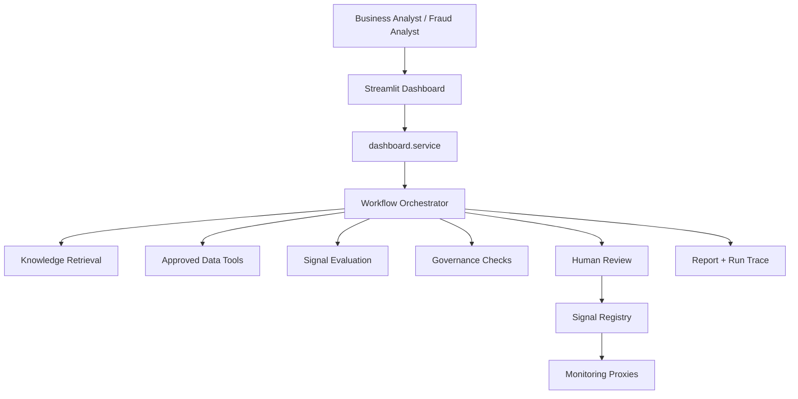

# Air-lab Fraud Agentic AI

## Summary

Air-lab Fraud Agentic AI is a local-first portfolio project that demonstrates an
agentic fraud-investigation and signal-discovery workflow. It combines governed
retrieval, deterministic data tools, workflow orchestration, human approval, auditable
reporting, and signal monitoring in a single repo.

## Business Objective

The goal is to help a fraud analyst investigate an ML-flagged alert, review evidence,
assess governance constraints, and decide whether a candidate fraud signal should be
promoted into a governed Signal Layer.

## Why Agentic AI?

Fraud investigation is not a single-model task. It requires orchestration across:

- alert context
- retrieved fraud typologies and policies
- approved data queries
- signal evaluation
- governance checks
- human review
- monitoring after promotion

This project demonstrates that pattern while keeping deterministic tools in control of
data access, governance, registry writes, and reporting.

## Local LLM Use

The CLI defaults to the local Ollama backend and `qwen3.6:35b-a3b` model. The model is
used only for bounded analyst-facing text: evidence narrative synthesis, case report
drafting, case copilot answers, and candidate-signal wording. Deterministic tools still
own data access, metrics, governance decisions, audit writes, and signal promotion.

Tests and offline demos can use the fake backend:

```bash
python -m airlab_fraud_agentic_ai.cli investigate --case-id A-1001 --llm-backend fake
```

## Architecture Diagram



## Governance Principles

- The dashboard does not contain fraud logic.
- The LLM can explain and reason, but deterministic tools own data access and control actions.
- Human approval is the promotion boundary.
- Reports and audit traces are written as explicit run artifacts.
- Monitoring outputs are sample-data proxies, not production fraud validation.

## Demo Scenarios

- `A-1001`: strong account-takeover style case with approvable candidate signal
- `A-1002`: lower-confidence case that tests analyst skepticism and threshold interpretation
- `A-1003`: synthetic identity case with governance-sensitive evidence and rejection path

## Setup

```bash
cd /Users/emilygao/LocalDocuments/Projects/fraud-agentic-ai
source .venv/bin/activate
uv pip install --python .venv/bin/python -e .
uv pip install --python .venv/bin/python -r requirements.txt
pytest
```

If you want the Streamlit UI:

```bash
streamlit run streamlit_app/fraud_case_dashboard.py --server.port 8890
```

## CLI Demo

Run an investigation:

```bash
python -m airlab_fraud_agentic_ai.cli investigate --case-id A-1001
```

Approve a pending signal:

```bash
python -m airlab_fraud_agentic_ai.cli review \
  --run-id <run_id> \
  --signal-id A-1001-SIG-1 \
  --decision approve \
  --reviewer fraud_analyst_demo
```

Show the report:

```bash
python -m airlab_fraud_agentic_ai.cli report --run-id <run_id>
```

Show monitoring:

```bash
python -m airlab_fraud_agentic_ai.cli monitor-signals
```

## Streamlit Demo

The dashboard is a thin analyst workspace over the service layer. Use it to:

- select a case
- run an investigation
- inspect evidence
- ask bounded case questions
- approve or reject candidate signals
- review governance and audit data
- download the markdown report and JSON run trace
- inspect Signal Layer monitoring proxies

## Project Structure

- `design/`: architecture, governance, workflow, signal-layer, and demo docs
- `data/`: sample BB-style datasets and dataset mapping
- `knowledge/`: fraud typologies, policies, and data dictionary content
- `signal_registry/`: candidate, approved, and rejected signal states
- `reports/`: persisted markdown case reports
- `runs/`: persisted JSON run traces
- `src/airlab_fraud_agentic_ai/`: workflow, agents, tools, governance, dashboard, and monitoring code
- `streamlit_app/`: analyst UI
- `tests/`: deterministic test suite

## LangChain / LangGraph Design

The repo now uses the real LangGraph Graph API with explicit state, node sequencing,
interrupt-based human review, checkpoint persistence, and durable artifacts. The
implementation is still lightweight and local, but the orchestration model now maps
directly to enterprise LangGraph patterns.

See:

- `design/langgraph_workflow.md`
- `design/architecture.md`

## Signal Layer Design

Candidate signals are generated from evidence, evaluated with deterministic metrics,
checked against governance rules, and only then moved into approved or rejected
registry states.

See:

- `design/signal_layer_design.md`
- `design/case_evidence_record_schema.md`

## Human-in-the-loop Approval

Signal promotion is intentionally separated from signal generation. The analyst or
reviewer is the only actor allowed to approve or reject a candidate signal. The
dashboard and CLI both enforce that boundary.

## Evaluation and Monitoring

The project includes:

- deterministic signal evaluation metrics
- governance checks for lineage, privacy, quality, and explainability
- report and run-trace artifacts
- post-approval monitoring proxies for coverage, drift, false positives, and decay

These monitoring outputs are useful for demos, governance discussion, and regression
testing, but they should not be described as production fraud validation.

## Enterprise Mapping

This local portfolio build maps to enterprise architecture patterns such as:

| Local component | Enterprise mapping |
|---|---|
| Local/fake LLM client | AWS Bedrock model endpoint or internal model gateway |
| Retrieval over markdown | Bedrock Knowledge Bases, OpenSearch, or enterprise RAG layer |
| Deterministic Python tools | API Gateway, Lambda, dbt metrics, or governed data services |
| Workflow orchestrator | LangGraph runtime, orchestration tier, or Step Functions-style control flow |
| Sample CSV datasets | Snowflake governed data platform or secure analytical views |
| YAML signal registry | Feature store or governed Signal Layer registry |
| Local reports and JSON traces | S3 audit artifacts, CloudWatch, observability, or governance evidence store |
| Streamlit dashboard | Internal analyst portal |

See:

- `design/enterprise_mapping.md`

## Documentation

- Architecture: `design/architecture.md`
- Pending review issues: `design/issues-pending-review.md`
- Governance model: `design/governance_model.md`
- Demo script: `design/demo_script.md`

## Current Status

The repo is ready for local demo and review with sample data. The fake backend keeps
tests and demos offline-safe; the Ollama backend can use `qwen3.6:35b-a3b` for bounded
analyst-facing text when the local model server is running.

## Limitations

- Sample data only; no production fraud labels or customer handling
- No authentication or real analyst entitlements
- Monitoring metrics are deterministic proxies
- The repo demonstrates enterprise patterns but is not production-ready infrastructure
- Local model/runtime options are environment-dependent

## LinkedIn Project Summary

Air-lab Fraud Agentic AI is a hands-on enterprise GenAI project demonstrating an
agentic fraud investigation and signal-discovery ecosystem using governed retrieval,
deterministic data tools, workflow orchestration, human-in-the-loop approval, auditable
reporting, and a governed Signal Layer.

The project simulates how a fraud analyst investigates an ML-flagged case by
orchestrating planner, retrieval, data-tool, signal-evaluation, governance, and
human-review components. It demonstrates stateful workflow orchestration, governed data
access, evidence-grounded reporting, signal lifecycle governance, and monitoring for
drift, false positives, and signal decay.
