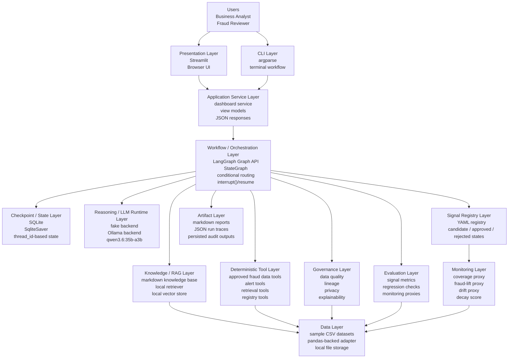
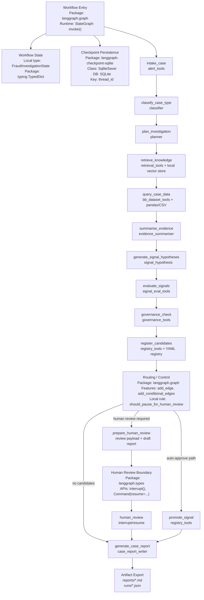

# Architecture

## 1. Purpose

Air-lab Fraud Agentic AI is a local-first enterprise AI architecture lab for analyst-assisted fraud investigation and governed signal discovery. It helps a fraud analyst investigate an ML-flagged alert, review evidence, evaluate candidate fraud signals, apply governance controls, and route signal promotion through human approval.

The project is deliberately not an autonomous fraud-decision system. It demonstrates how an agentic workflow can coordinate reasoning, retrieval, deterministic data tools, governance checks, human review, audit traces, and local demo artifacts while preserving control boundaries.

## 2. Current System Shape

The system has two user entry points:

- CLI commands in `src/airlab_fraud_agentic_ai/cli.py`
- Streamlit dashboard in `streamlit_app/fraud_case_dashboard.py`

Both entry points call `airlab_fraud_agentic_ai.dashboard.service`, which then calls the LangGraph workflow in `airlab_fraud_agentic_ai.graph.workflow`. The workflow coordinates deterministic tools, bounded local LLM calls, RAG retrieval, signal evaluation, governance checks, human review, registry writes, and report/run-trace persistence.

The LLM backend is configurable. `ollama` with `qwen3.6:35b-a3b` is used for bounded analyst-facing text only. `fake` is used for tests and offline demos.

The key architectural rule is strict separation between:

- presentation
- service orchestration
- workflow state/control
- bounded reasoning
- deterministic controls
- governed artifacts

```text
Business Analyst / Reviewer
            |
            v
     Streamlit Dashboard
            |
            v
     dashboard.service
            |
            v
 LangGraph Workflow / StateGraph
            |
            +-- LLM reasoning layer
            +-- RAG / knowledge retrieval
            +-- approved data tools
            +-- governance checks
            +-- signal evaluation
            +-- signal registry
            +-- reports and run traces
```

## 3. Component Map

| Component | Path | Responsibility | Key dependencies |
|---|---|---|---|
| CLI | `src/airlab_fraud_agentic_ai/cli.py` | Investigation, review, report, and monitoring commands | `dashboard.service`, argparse |
| Dashboard UI | `streamlit_app/fraud_case_dashboard.py` | Analyst-facing case workspace | Streamlit, `dashboard.service` |
| Service layer | `src/airlab_fraud_agentic_ai/dashboard/service.py` | Stable application API for UI and tests | Workflow, view models, registry tools |
| Workflow | `src/airlab_fraud_agentic_ai/graph/workflow.py` | LangGraph orchestration, checkpointing, human interrupt/resume | LangGraph, SQLite checkpointer |
| State contract | `src/airlab_fraud_agentic_ai/graph/state.py` | Shared workflow state shape | TypedDict |
| LLM runtime | `src/airlab_fraud_agentic_ai/agents/llm_factory.py` | Fake and Ollama-backed model invocation | urllib, local Ollama |
| Reasoning helpers | `src/airlab_fraud_agentic_ai/agents/` | Classification, planning, evidence narrative, signal wording, report drafting | Deterministic functions, optional local LLM |
| Data tools | `src/airlab_fraud_agentic_ai/tools/` | Approved alert, retrieval, case data, governance, signal evaluation, and registry actions | Pandas, sample CSVs, YAML |
| Data adapter | `src/airlab_fraud_agentic_ai/data/` | Sample data loading and Pydantic contracts | pandas, Pydantic |
| RAG layer | `src/airlab_fraud_agentic_ai/rag/` | Local markdown retrieval and vector-store support | knowledge files |
| Governance | `src/airlab_fraud_agentic_ai/governance/` | Quality, lineage, privacy, and explainability checks | sample metadata |
| Signal layer | `src/airlab_fraud_agentic_ai/signal_layer/` | Signal schema, registry support, monitoring proxies | YAML registry, sample data |
| Knowledge base | `knowledge/` | Typologies, policies, and data dictionary content | Markdown |
| Sample data | `data/sample/` | Fake fraud investigation datasets | CSV |
| Artifacts | `reports/`, `runs/` | Local generated reports, JSON traces, checkpoints | Ignored generated files plus `.gitkeep` |
| Tests | `tests/` | Unit, workflow, dashboard service, LLM wiring, monitoring, and governance tests | pytest |

## 3.1 Full Stack View



## 4. Runtime Flow

```text
Alert ID or analyst request
  -> CLI or Streamlit dashboard
  -> dashboard.service
  -> LangGraph FraudInvestigationWorkflow
  -> intake, classify, plan
  -> retrieve knowledge and query approved data tools
  -> bounded evidence narrative with selected LLM backend
  -> deterministic signal candidate generation plus optional wording rewrite
  -> deterministic signal evaluation
  -> deterministic governance checks
  -> candidate registration
  -> human review interrupt or auto-approve demo path
  -> deterministic registry update
  -> bounded report draft with selected LLM backend
  -> persisted report, run trace, audit log
```

## 4.1 Workflow / Orchestration Deep Dive



This structure matters because the Streamlit app stays presentation-only, the service layer hides workflow complexity from the UI, LangGraph owns orchestration and checkpointed state, and deterministic tools own governed data access and control actions. The LLM runtime is a dependency of bounded analyst-facing text, not the orchestration or decision engine.

## 5. Data Flow

The LLM never reads raw datasets directly. Case data moves through deterministic tools:

- `alert_tools` reads alert records.
- `bb_dataset_tools` queries sample customer, account, transaction, behavioural, feature, data-quality, and lineage CSVs.
- `retrieval_tools` retrieves markdown typologies, policies, and data definitions.
- `governance_tools` aggregates deterministic quality, lineage, privacy, and explainability checks.
- `signal_eval_tools` computes deterministic signal metrics.
- `registry_tools` writes candidate, approved, and rejected signal registry entries.

Evidence and report text are generated from structured summaries, retrieved references, governance findings, and audit state. Generated reports and traces are stored under `reports/` and `runs/`; those generated files are ignored except for `.gitkeep`.

## 6. Configuration

Environment variables:

| Variable | Default | Purpose |
|---|---|---|
| `AIRLAB_ROOT_DIR` | repository root | Override project root |
| `AIRLAB_DATA_DIR` | `data/` | Sample data location |
| `AIRLAB_DOCS_DIR` | `design/` | Documentation location |
| `AIRLAB_KNOWLEDGE_DIR` | `knowledge/` | RAG knowledge location |
| `AIRLAB_REPORTS_DIR` | `reports/` | Generated report output |
| `AIRLAB_RUNS_DIR` | `runs/` | Generated trace/checkpoint output |
| `AIRLAB_CHECKPOINT_DB_PATH` | `runs/langgraph_checkpoints.sqlite` | LangGraph SQLite checkpoint path |
| `AIRLAB_REGISTRY_DIR` | `signal_registry/` | Signal registry directory |
| `LOCAL_LLM_BACKEND` | `ollama` | LLM backend selector; use `fake` for offline tests |
| `LOCAL_LLM_PROVIDER` | none | Backward-compatible alias for `LOCAL_LLM_BACKEND` |
| `MODEL_NAME` | `qwen3.6:35b-a3b` | Local model name |
| `OLLAMA_HOST` | `http://127.0.0.1:11434` | Ollama API host |

Do not commit `.env` files or secret values. This repo uses fake/sample data only.

## 7. Testing and SIT

Primary test command:

```bash
uv run pytest
```

Practical SIT smoke command:

```bash
.venv/bin/python -m airlab_fraud_agentic_ai.cli investigate --case-id A-1001 --llm-backend fake
```

The fake backend keeps SIT independent of paid keys and local Ollama availability.

## 8. Deployment / Execution

Install and run locally:

```bash
cd /Users/emilygao/LocalDocuments/Projects/fraud-agentic-ai
source .venv/bin/activate
uv pip install --python .venv/bin/python -e .
uv pip install --python .venv/bin/python -r requirements.txt
```

CLI:

```bash
.venv/bin/python -m airlab_fraud_agentic_ai.cli investigate --case-id A-1001 --llm-backend fake
```

Dashboard:

```bash
.venv/bin/streamlit run streamlit_app/fraud_case_dashboard.py --server.port 8890
```

Local Qwen/Ollama mode requires Ollama to be running and `qwen3.6:35b-a3b` to be available.

## 9. Governance / Operational Notes

- The LLM does not access raw datasets.
- The LLM does not generate or execute SQL.
- The LLM does not make final fraud decisions.
- Signal promotion requires human approval unless the local demo auto-approve path is explicitly used.
- Dashboard actions call service/workflow functions instead of duplicating fraud logic.
- Analyst decisions and workflow steps are captured in the audit trace.
- Reports and run traces are generated local artifacts, not production evidence.
- Monitoring metrics are deterministic sample-data proxies, not production fraud validation.

Enterprise boundary mapping:

| Local component | Enterprise interpretation |
|---|---|
| `streamlit_app/` | Internal analyst portal |
| `dashboard.service` | Application service layer |
| `graph/` | Stateful orchestration tier |
| LangGraph + SQLite checkpointer | Workflow runtime and checkpoint store |
| `tools/` | Governed tool/API layer |
| `knowledge/` + `rag/` | Enterprise retrieval layer |
| `signal_registry/` | Governed Signal Layer or feature registry |
| `reports/` + `runs/` | Audit evidence and observability artifacts |

## 10. Known Gaps

See `design/issues-pending-review.md`.
