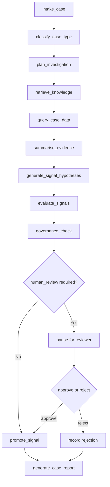

# LangGraph Workflow Design

The project is designed as a stateful fraud-investigation workflow with explicit node
order, persisted state, and a human review pause.

## Workflow Nodes

1. `intake_case`
2. `classify_case_type`
3. `plan_investigation`
4. `retrieve_knowledge`
5. `query_case_data`
6. `summarise_evidence`
7. `generate_signal_hypotheses`
8. `evaluate_signals`
9. `governance_check`
10. `human_review`
11. `promote_signal`
12. `generate_case_report`

## Mermaid Flow

## State Model

The state carries:

- alert and analyst request
- case type and risk level
- retrieved knowledge
- approved data-tool results
- evidence summary
- candidate signals
- evaluation and governance outputs
- human review status
- promoted signals
- final report text
- audit log

## Design Rules

- Node responsibilities should stay narrow and inspectable.
- Pause/resume state should be durable.
- Human review is the promotion boundary.
- Reports and traces should be produced from state, not reconstructed from UI state.

## Why This Matters

This structure makes the project easy to explain in enterprise terms:

- explicit stateful orchestration
- deterministic control boundaries
- auditable decision path
- portable UI over a stable service layer
