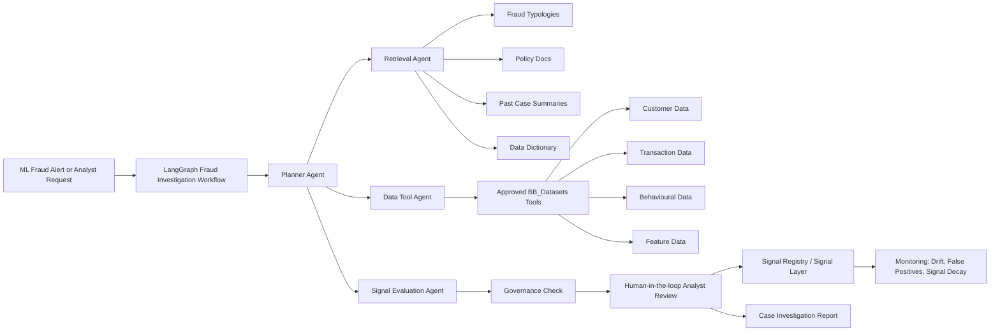
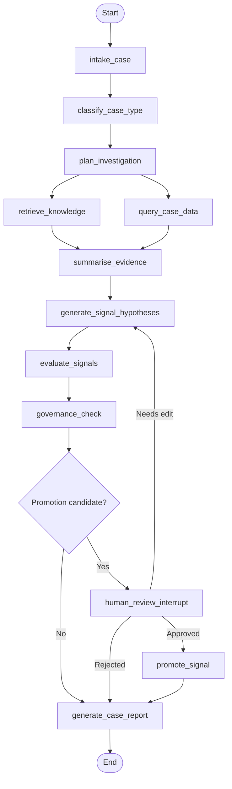

# Air-lab Fraud Agentic AI

**Project subtitle:** Agentic fraud investigation and signal-discovery ecosystem using LangChain, LangGraph, governed RAG, BB_Datasets and human-in-the-loop signal promotion.

---

## 1. Project purpose

**Air-lab Fraud Agentic AI** is a hands-on enterprise GenAI project designed to help you learn and demonstrate an **Agentic AI ecosystem** using **LangChain** and **LangGraph**.

The project simulates how a fraud analyst investigates an ML-flagged case by orchestrating multiple AI and deterministic components:

- planner agent
- retrieval agent
- approved data tools
- signal evaluation agent
- governance checks
- human-in-the-loop approval
- signal promotion
- monitoring

The project is deliberately designed as an **enterprise AI architecture lab**, not a chatbot demo.

The key architectural principle is:

> The LLM reasons and explains, but deterministic tools retrieve, query, evaluate, govern and promote.

This makes the project suitable for regulated-enterprise positioning, especially financial services, fraud, risk and compliance use cases.

---

## 2. Business objective

Use this as the primary business objective:

> Help a fraud analyst investigate an ML-flagged fraud case by orchestrating retrieval, approved data queries, signal evaluation, governance checks and human approval, then promote validated fraud signals into a governed Signal Layer.

This combines two strong use cases:

1. **Fraud investigation copilot**  
   An analyst investigates a potential fraud case already flagged by an ML model.

2. **Emerging fraud signal discovery**  
   Across multiple investigated cases, the system identifies candidate fraud signals, evaluates their usefulness, applies governance controls, and promotes validated signals into a governed Signal Layer.

---

## 3. Recommended project name

Use this as the GitHub / LinkedIn project name:

> **Air-lab Fraud Agentic AI**

Optional longer title:

> **Air-lab Fraud Agentic AI — Agentic Fraud Investigation & Signal Discovery**

---

## 4. What this project demonstrates

| Capability | What the project proves |
|---|---|
| **Agentic AI ecosystem** | You can design a multi-step AI workflow that plans, retrieves, queries, evaluates, governs and escalates. |
| **LangChain** | You can connect LLMs to prompts, retrievers, tools and structured outputs. |
| **LangGraph** | You can model stateful workflows using graph state, nodes, edges, conditional routing and human interrupts. |
| **RAG** | The system retrieves fraud typologies, policies, data definitions and historical case context before producing recommendations. |
| **Governed data access** | The LLM cannot directly access raw tables or execute unrestricted SQL. It must use approved tools. |
| **Signal Layer** | Validated candidate signals are promoted into a governed signal registry. |
| **Responsible AI** | The workflow includes lineage, data quality, privacy, explainability, auditability and human approval controls. |
| **Enterprise architecture** | The project maps local components to AWS Bedrock, Snowflake, SageMaker, API Gateway, Lambda and enterprise monitoring patterns. |

---

## 5. Scope

Do not try to build a full fraud-detection production system.

Build a focused, portfolio-grade agentic workflow with enough realism to show architecture maturity.

### In scope

1. Case investigation copilot
2. Agentic RAG over fraud knowledge
3. Safe data tools over BB_Datasets
4. Signal hypothesis generation
5. Signal evaluation
6. Governance check
7. Human approval
8. Signal registry
9. Case report and audit trail
10. Basic signal monitoring

### Out of scope

- Production fraud-detection engine
- Real customer PII
- Fully autonomous fraud decisions
- Unrestricted SQL generation by LLMs
- Automatic deployment of fraud rules without human approval

---

## 6. Assumed BB_Datasets structure

Design an adapter layer so the exact table names in BB_Datasets do not matter.

Assume BB_Datasets can expose some or all of these entities:

| Dataset area | Example fields |
|---|---|
| **Customer** | customer_id, age_band, tenure, segment, geography, risk_rating |
| **Account** | account_id, product_type, open_date, status |
| **Transaction** | transaction_id, timestamp, amount, merchant, channel, device_id, payee_id, location |
| **Behavioural** | login_time, device_change, velocity, failed_login_count, session_duration |
| **ML alerts** | alert_id, customer_id, model_score, threshold, triggered_features, alert_time |
| **Historical labels** | case_id, confirmed_fraud_flag, investigation_outcome, loss_amount |
| **Features** | feature_name, feature_value, window, source_table, calculation_logic |
| **Data quality** | dataset_name, freshness, null_rate, anomaly_count |
| **Lineage / metadata** | field_name, source_system, owner, sensitivity, certification_status |

If BB_Datasets does not yet contain all these entities, create synthetic sample versions. The architecture is more important than perfect dataset realism.

---

## 7. Target user journey

### Scenario

An ML model flags a customer because of unusual transaction velocity, device switching and anomalous payee behaviour.

### Analyst request

> Investigate alert A-10293. Explain why the case was flagged, compare it to known fraud typologies, check related behavioural signals, and recommend next steps.

### Agentic system workflow

1. Reads the ML alert.
2. Plans the evidence required.
3. Retrieves fraud typologies, policy notes and data definitions.
4. Queries approved BB_Datasets tools.
5. Summarises customer, transaction and behavioural evidence.
6. Generates candidate fraud signals.
7. Evaluates whether signals are meaningful.
8. Runs governance checks.
9. Pauses for analyst approval.
10. Promotes approved signals to the Signal Layer.
11. Produces an auditable case report.

---

## 8. High-level architecture



---

## 9. LangGraph workflow design

Use LangGraph because this is not a simple chatbot. It is a **stateful, multi-step investigation workflow**.

The graph should include:

- shared investigation state
- nodes for each workflow step
- conditional edges for branching decisions
- human-in-the-loop interrupt before signal promotion
- audit trail capture
- final report generation

### Main graph nodes

| Node | Purpose | Agentic or deterministic? |
|---|---|---|
| `intake_case` | Load alert or analyst request | Deterministic |
| `classify_case_type` | Identify alert type: account takeover, mule activity, synthetic identity, scam, abnormal velocity | LLM + rules |
| `plan_investigation` | Decide required evidence | LLM planner |
| `retrieve_knowledge` | Retrieve typologies, policies, data definitions and similar cases | RAG tool |
| `query_case_data` | Query approved customer, transaction and behavioural data | Deterministic tool |
| `summarise_evidence` | Create evidence summary grounded in retrieved data | LLM |
| `generate_signal_hypotheses` | Propose candidate fraud signals | LLM + rules |
| `evaluate_signals` | Test signal strength, explainability and coverage | Deterministic statistics |
| `governance_check` | Check data quality, lineage, PII, explainability and policy constraints | Deterministic + LLM explanation |
| `human_review` | Analyst approves, rejects or edits recommendation | LangGraph interrupt |
| `promote_signal` | Add approved signal to Signal Registry | Deterministic |
| `generate_case_report` | Produce final analyst report with evidence and audit trail | LLM + template |
| `monitor_signal` | Track drift, false positives and decay | Deterministic |

---

## 10. Recommended graph flow



This graph teaches the key LangGraph concepts:

- state
- nodes
- edges
- conditional routing
- human interruption
- resumable execution
- auditable workflow progression

---

## 11. State design

Create a shared graph state.

```python
from typing import TypedDict, List, Dict, Optional, Any

class FraudInvestigationState(TypedDict, total=False):
    case_id: str
    analyst_request: str

    alert: Dict[str, Any]
    case_type: str
    risk_level: str

    investigation_plan: List[Dict[str, Any]]

    retrieved_typologies: List[Dict[str, Any]]
    retrieved_policies: List[Dict[str, Any]]
    retrieved_data_definitions: List[Dict[str, Any]]
    similar_cases: List[Dict[str, Any]]

    customer_profile: Dict[str, Any]
    transaction_summary: Dict[str, Any]
    behavioural_summary: Dict[str, Any]
    feature_summary: Dict[str, Any]

    evidence_summary: str

    signal_candidates: List[Dict[str, Any]]
    signal_evaluations: List[Dict[str, Any]]
    governance_findings: Dict[str, Any]

    human_review_status: str
    human_review_comments: Optional[str]

    promoted_signals: List[Dict[str, Any]]

    final_case_report: str
    audit_log: List[Dict[str, Any]]
```

This is one of the most important artefacts in the project. It shows that you understand what belongs in agent state and why.

---

## 12. Agent and tool design

### 12.1 Planner agent

Purpose:

> Decide what evidence is needed to investigate the case.

Example output:

```json
{
  "case_type": "possible_account_takeover",
  "evidence_needed": [
    "customer profile",
    "recent transaction velocity",
    "device change history",
    "new payee activity",
    "login behaviour",
    "similar fraud typologies",
    "data quality status"
  ],
  "risk_level": "high",
  "requires_human_review": true
}
```

The planner agent should not directly query data. It only plans.

---

### 12.2 Retrieval agent

Purpose:

> Retrieve relevant fraud typologies, case patterns, policy documents and data definitions.

Knowledge base structure:

```text
knowledge/
  fraud_typologies/
    account_takeover.md
    mule_account.md
    scam_payment.md
    synthetic_identity.md
  policies/
    fraud_escalation_policy.md
    data_privacy_policy.md
    analyst_review_guidelines.md
  data_dictionary/
    transaction_features.md
    behavioural_features.md
    signal_definitions.md
  model_docs/
    fraud_model_card.md
    feature_importance_notes.md
```

The retrieval agent should answer questions such as:

> What typologies are relevant to sudden device change followed by high-value transfer to a new payee?

---

### 12.3 Data tool agent

Purpose:

> Query BB_Datasets through approved tools.

Do not let the LLM write arbitrary SQL directly.

Create safe tools such as:

```python
def get_alert(alert_id: str) -> dict:
    """Return ML alert metadata for a given alert ID."""

def get_customer_profile(customer_id: str) -> dict:
    """Return approved customer profile fields."""

def get_transaction_velocity(customer_id: str, window_days: int) -> dict:
    """Return transaction velocity metrics for a defined window."""

def get_new_payee_activity(customer_id: str, window_days: int) -> dict:
    """Return new payee count and associated transaction values."""

def get_device_change_summary(customer_id: str, window_days: int) -> dict:
    """Return recent device changes, login channel changes and geolocation anomalies."""

def get_feature_values(alert_id: str) -> dict:
    """Return model feature values and feature metadata for an alert."""
```

This demonstrates a governance-led AI pattern: the LLM uses tools, but the data-access boundary is deterministic and controlled.

---

### 12.4 Signal evaluation agent

Purpose:

> Evaluate whether candidate fraud signals are meaningful, explainable and useful.

Candidate signal example:

```json
{
  "signal_name": "new_device_high_value_new_payee_velocity",
  "description": "Customer changed device and initiated high-value transfers to a new payee within 24 hours.",
  "source_features": [
    "device_change_count_24h",
    "new_payee_count_24h",
    "transaction_amount_zscore_24h"
  ],
  "hypothesis": "May indicate account takeover or scam-induced payment.",
  "expected_direction": "higher values increase risk"
}
```

Evaluation metrics:

| Metric | Why it matters |
|---|---|
| **Coverage** | How many cases contain this signal? |
| **Precision proxy** | How often does this signal appear in confirmed fraud versus non-fraud? |
| **Lift** | Does the signal improve risk separation? |
| **Stability** | Does it behave consistently over time? |
| **Explainability** | Can an analyst understand it? |
| **Data quality** | Are the source fields complete and fresh? |
| **Actionability** | Can an analyst act on it? |

Simple evaluation function:

```python
def evaluate_signal(candidate_signal: dict, dataset) -> dict:
    return {
        "signal_name": candidate_signal["signal_name"],
        "coverage_rate": 0.18,
        "fraud_lift": 2.7,
        "false_positive_risk": "medium",
        "data_quality_status": "pass",
        "explainability_score": 4,
        "recommendation": "candidate_for_human_review"
    }
```

---

### 12.5 Governance check

Purpose:

> Check whether the signal can be safely promoted.

Governance checks:

| Check | Example |
|---|---|
| **Lineage** | Which fields and source tables created the signal? |
| **Data quality** | Are source fields fresh, complete and stable? |
| **Privacy** | Does the signal expose PII or sensitive attributes? |
| **Bias risk** | Does the signal rely on inappropriate demographic proxies? |
| **Explainability** | Can an analyst understand the signal? |
| **Auditability** | Can the recommendation be traced back to evidence? |
| **Approval requirement** | Does this require fraud lead approval? |

Example governance output:

```json
{
  "governance_status": "conditional_pass",
  "lineage_status": "pass",
  "data_quality_status": "pass",
  "privacy_status": "pass_after_pii_redaction",
  "explainability_status": "pass",
  "approval_required": true,
  "comments": "Signal is suitable for analyst review but should not be automatically deployed."
}
```

---

### 12.6 Human-in-the-loop approval

Use LangGraph `interrupt()` before signal promotion.

Conceptual implementation:

```python
from langgraph.types import interrupt

def human_review_node(state: FraudInvestigationState):
    review_payload = {
        "case_id": state["case_id"],
        "signal_candidates": state["signal_candidates"],
        "signal_evaluations": state["signal_evaluations"],
        "governance_findings": state["governance_findings"],
        "evidence_summary": state["evidence_summary"]
    }

    decision = interrupt(review_payload)

    return {
        "human_review_status": decision["status"],
        "human_review_comments": decision.get("comments")
    }
```

This is a strong learning point because human-in-the-loop approval is where agentic systems become enterprise-safe.

---

## 13. Signal Layer design

Create a local signal registry.

```text
signal_registry/
  approved_signals.yaml
  candidate_signals.yaml
  rejected_signals.yaml
```

Example approved signal:

```yaml
signal_id: SIG-ATO-001
signal_name: new_device_high_value_new_payee_velocity
business_domain: fraud
fraud_typology: account_takeover
description: >
  Identifies cases where a customer changes device and initiates
  high-value transfers to new payees within a short time window.
source_features:
  - device_change_count_24h
  - new_payee_count_24h
  - transaction_amount_zscore_24h
lineage:
  source_datasets:
    - behavioural_events
    - transactions
    - payee_events
governance:
  data_quality_status: pass
  privacy_status: pass
  explainability_status: pass
  approved_by: fraud_analyst
  approval_date: "2026-04-24"
monitoring:
  drift_check: enabled
  false_positive_monitoring: enabled
  review_frequency: monthly
status: approved
```

This supports the core concept:

> AI should operate on validated, governed, high-confidence signals — not raw, unvalidated noise.

---

## 14. Case report output

The final output should look like an analyst-ready report.

```markdown
# Fraud Investigation Report

## Case Summary
Alert A-10293 was flagged due to elevated transaction velocity,
new payee activity and recent device change behaviour.

## Relevant Fraud Typologies
- Account takeover
- Scam-induced payment
- Mule account activity

## Evidence Reviewed
- Customer profile
- Transaction velocity over 24h and 7d windows
- Device and login behaviour
- Payee novelty
- Model feature values
- Similar historical cases

## Key Findings
1. Customer changed device within 6 hours of high-value payment.
2. Two new payees were created within 24 hours.
3. Transaction amount exceeded normal customer pattern.
4. Retrieved typology suggests account takeover risk.

## Candidate Signal
`new_device_high_value_new_payee_velocity`

## Signal Evaluation
- Coverage: 18%
- Fraud lift: 2.7x
- Data quality: Pass
- Explainability: High
- False positive risk: Medium

## Governance Result
Conditional pass. Human review required before promotion.

## Analyst Decision
Approved for Signal Layer candidate monitoring.

## Recommended Next Action
Escalate case for manual fraud review and monitor approved signal
over the next evaluation cycle.
```

---

## 15. Suggested technology stack

Keep it local-first, then map it to enterprise architecture.

| Layer | Local implementation | Enterprise mapping |
|---|---|---|
| LLM | OpenAI / local Ollama / LM Studio | AWS Bedrock |
| Agent orchestration | LangGraph | LangGraph / Bedrock Agents / enterprise orchestration |
| Agent tools | LangChain tools | API Gateway + Lambda tools |
| Data store | DuckDB or SQLite | Snowflake |
| Vector store | FAISS or Chroma | OpenSearch, Pinecone, Bedrock Knowledge Base, Snowflake Cortex Search |
| Knowledge docs | Markdown/PDF | Enterprise knowledge base |
| UI | Streamlit | Internal analyst portal |
| Observability | JSON logs / LangSmith optional | LangSmith, CloudWatch, enterprise observability |
| Signal registry | YAML / SQLite | Feature Store / Signal Layer / governed registry |
| Evaluation | Python metrics | SageMaker Model Monitor / MLflow / enterprise evaluation service |

---

## 16. Suggested repository structure

```text
airlab-fraud-agentic-ai/
  README.md
  architecture/
    solution_overview.md
    langgraph_workflow.md
    governance_model.md
    signal_layer_design.md
    mermaid_graphs.md

  data/
    README.md
    sample_alerts.csv
    sample_customers.csv
    sample_transactions.csv
    sample_behavioural_events.csv
    sample_features.csv

  knowledge/
    fraud_typologies/
      account_takeover.md
      mule_account.md
      scam_payment.md
      synthetic_identity.md
    policies/
      fraud_escalation_policy.md
      data_privacy_policy.md
      signal_promotion_policy.md
    data_dictionary/
      transaction_features.md
      behavioural_features.md
      model_features.md

  src/
    app.py

    graph/
      state.py
      workflow.py
      routing.py

    agents/
      planner.py
      evidence_summariser.py
      signal_hypothesis.py
      case_report_writer.py

    tools/
      alert_tools.py
      bb_dataset_tools.py
      retrieval_tools.py
      signal_eval_tools.py
      governance_tools.py
      registry_tools.py

    rag/
      ingest_knowledge.py
      build_vector_store.py
      retriever.py

    signal_layer/
      registry.py
      signal_schema.py
      monitoring.py

    governance/
      lineage_check.py
      data_quality_check.py
      privacy_check.py
      explainability_check.py

    evaluation/
      signal_metrics.py
      case_report_eval.py
      regression_tests.py

  signal_registry/
    candidate_signals.yaml
    approved_signals.yaml
    rejected_signals.yaml

  notebooks/
    01_explore_bb_datasets.ipynb
    02_signal_evaluation.ipynb
    03_agentic_workflow_trace.ipynb

  tests/
    test_tools.py
    test_signal_eval.py
    test_governance.py
    test_workflow_routes.py

  streamlit_app/
    fraud_case_copilot.py

  requirements.txt
  pyproject.toml
```

---

## 17. Build phases

### Phase 1 — Dataset adapter and fraud case intake

**Goal:** Connect BB_Datasets to approved data tools.

Deliverables:

- Load BB_Datasets into DuckDB or SQLite.
- Create alert records.
- Build deterministic functions for customer, transaction and behavioural summaries.
- Add test cases.

Key learning:

> LangChain tools should wrap controlled functions, not expose unrestricted data access.

---

### Phase 2 — Fraud knowledge RAG

**Goal:** Build a fraud knowledge base the agent can retrieve from.

Deliverables:

- Markdown fraud typology documents.
- Data dictionary documents.
- Policy documents.
- Vector index using FAISS or Chroma.
- Retriever tool.

Key learning:

> Agentic RAG is not just retrieval; the agent decides when retrieved knowledge is required.

---

### Phase 3 — LangGraph case investigation workflow

**Goal:** Implement the core graph.

Deliverables:

- `FraudInvestigationState`
- Graph nodes
- Conditional edges
- Basic report generation
- Audit log

Key learning:

> LangGraph gives you control over workflow state and transitions.

---

### Phase 4 — Signal hypothesis and evaluation

**Goal:** Move from case explanation to candidate signal discovery.

Deliverables:

- Candidate signal generator.
- Evaluation metrics.
- Explainability scoring.
- Governance scoring.
- Candidate signal registry.

Key learning:

> This is where the Signal Layer concept becomes tangible.

---

### Phase 5 — Human approval and signal promotion

**Goal:** Add enterprise control before promotion.

Deliverables:

- LangGraph interrupt before promotion.
- Analyst approval / rejection / edit workflow.
- Approved signal written to registry.
- Final report updated with decision.

Key learning:

> Agentic AI in regulated enterprises must include approval gates, not just autonomous execution.

---

### Phase 6 — Monitoring dashboard

**Goal:** Show post-promotion monitoring.

Deliverables:

- Signal status dashboard.
- Drift check.
- False-positive proxy.
- Signal decay score.
- Review status.

Key learning:

> Signals need lifecycle management, not one-off generation.

---

## 18. Minimum viable demo

Your first working demo should support this command:

```bash
python src/app.py --case-id A-1001
```

Expected flow:

```text
1. Load alert A-1001
2. Classify suspected typology
3. Plan evidence
4. Retrieve fraud typology and policy context
5. Query BB_Datasets tools
6. Summarise evidence
7. Generate candidate signal
8. Evaluate signal
9. Run governance check
10. Pause for analyst approval
11. Promote or reject signal
12. Generate final case report
```

This is enough to demonstrate in an interview.

---

## 19. README structure

Use this README structure for the GitHub repo:

```markdown
# Air-lab Fraud Agentic AI

## Purpose
This project demonstrates an agentic fraud investigation and signal-discovery ecosystem using LangChain, LangGraph, governed RAG and BB_Datasets.

## Business Objective
Help fraud analysts investigate ML-flagged cases and identify emerging fraud signals from customer, transaction and behavioural data.

## Architecture
Include Mermaid graph.

## Why Agentic AI?
Explain why this is more than a chatbot:
- planning
- retrieval
- tool use
- data querying
- signal evaluation
- governance
- human approval
- signal promotion

## Dataset
Explain BB_Datasets and any synthetic/sample data.

## Key Capabilities
- ML alert intake
- fraud typology retrieval
- approved data tools
- signal hypothesis generation
- signal evaluation
- governance checks
- human-in-the-loop approval
- signal registry
- case report generation

## Technologies
LangChain, LangGraph, Python, DuckDB/SQLite, FAISS/Chroma, Streamlit, optional LangSmith, optional AWS Bedrock/Snowflake mapping.

## Governance Principles
- LLM cannot directly query raw data
- LLM cannot approve or promote signals
- deterministic tools enforce access boundaries
- human approval required for signal promotion
- all outputs include evidence and audit trail

## Demo
Show sample case and output report.

## Enterprise Mapping
Map local components to AWS Bedrock, Lambda, API Gateway, Snowflake, SageMaker Feature Store and model monitoring.
```

---

## 20. What to avoid

Avoid making the project sound like:

> I built an autonomous fraud detection system.

That may sound risky and overclaimed.

Use this positioning instead:

> An agentic investigation and signal-discovery assistant with governed tools, deterministic controls and human approval.

Also avoid:

- letting the LLM generate unrestricted SQL
- letting the LLM decide final fraud outcomes
- using real customer PII
- claiming production fraud detection
- using “self-improving” as the lead phrase
- making the system fully autonomous

Use safer language:

- evaluation-driven signal discovery
- governed signal promotion
- human-approved Signal Layer
- agent-assisted fraud investigation

---

## 21. LinkedIn project description after completion

Use this when adding the completed project to LinkedIn:

> **Air-lab Fraud Agentic AI** is a hands-on enterprise GenAI project demonstrating an agentic fraud investigation and signal-discovery ecosystem using LangChain, LangGraph, governed RAG and BB_Datasets.
>
> The project simulates how a fraud analyst investigates an ML-flagged case by orchestrating planner, retrieval, data-tool, signal-evaluation, governance and human-review agents. The workflow retrieves fraud typologies, policy documents, data definitions and historical case context; queries approved customer, transaction and behavioural data tools; generates candidate fraud signals; evaluates signal usefulness; performs governance checks; and promotes approved signals into a governed Signal Layer.
>
> Key architecture patterns include agentic RAG, LangGraph stateful orchestration, human-in-the-loop approval, deterministic data-access boundaries, signal lifecycle governance, auditability, explainability and monitoring for drift, false positives and signal decay.
>
> Technologies: **Python, LangChain, LangGraph, DuckDB/SQLite, FAISS/Chroma, Streamlit, BB_Datasets, RAG, semantic search, signal registry, governance checks and optional AWS Bedrock/Snowflake mapping.**

---

## 22. Interview explanation

Use this if asked about LangChain or LangGraph:

> I built an agentic fraud investigation project using LangChain and LangGraph. LangChain was used to define tools and retrieval components, while LangGraph orchestrated the stateful investigation workflow. The graph handled alert intake, evidence planning, RAG retrieval, approved data queries, signal hypothesis generation, statistical evaluation, governance checks, human approval and signal promotion.
>
> The important design decision was that the LLM did not directly query raw data or approve fraud outcomes. It reasoned over evidence retrieved through governed tools. Signal promotion required human approval and all outputs were captured with evidence, lineage and audit traceability. That made the project closer to an enterprise AI architecture pattern than a chatbot demo.

---

## 23. Learning outcomes

By completing this project, you will be able to explain and demonstrate:

- what an Agentic AI ecosystem is
- how LangChain tools and retrievers work
- how LangGraph orchestrates multi-step workflows
- how graph state is designed
- how conditional routing works
- how human-in-the-loop approval works
- how RAG supports fraud investigation
- how to separate deterministic governance from probabilistic LLM reasoning
- how to design a Signal Layer
- how to evaluate and promote candidate signals
- how to produce an auditable AI-assisted case report

---

## 24. Enterprise architecture mapping

| Local component | Enterprise equivalent |
|---|---|
| LangGraph workflow | Enterprise AI orchestration layer |
| LangChain tools | Approved API / Lambda / service tools |
| DuckDB / SQLite | Snowflake |
| FAISS / Chroma | Bedrock Knowledge Bases, OpenSearch, Pinecone, Snowflake Cortex Search |
| YAML signal registry | Feature Store / Signal Registry / Data Product Catalogue |
| Streamlit app | Internal fraud analyst portal |
| JSON audit logs | CloudWatch / enterprise observability / GRC evidence store |
| Local LLM / OpenAI | AWS Bedrock model endpoint |
| Signal evaluation scripts | SageMaker / MLflow / model monitoring |

---

## 25. Positioning statement

Use this as the strategic summary of the project:

> Air-lab Fraud Agentic AI demonstrates how regulated enterprises can use Agentic AI safely by combining LLM reasoning, governed retrieval, approved data tools, deterministic evaluation, human approval and auditable signal promotion. It shows that enterprise AI is not just about generating answers, but about designing the control, data, governance and lifecycle architecture that allows AI systems to be trusted in production.

