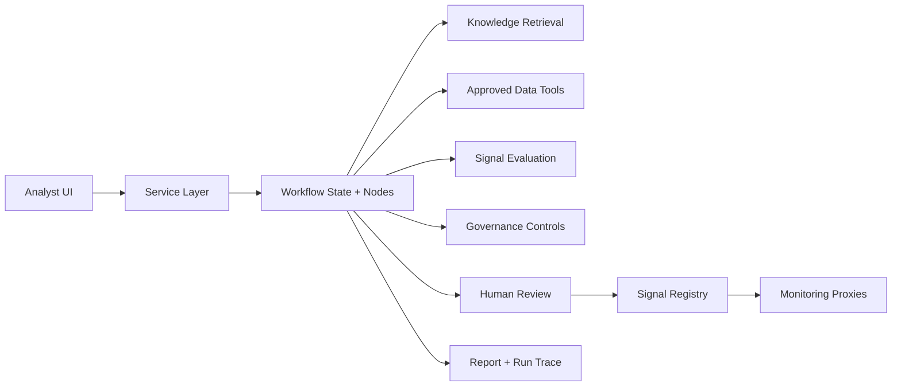

# Architecture Overview

Air-lab Fraud Agentic AI is structured to look like an enterprise analyst-assist
platform rather than a single chatbot. The architecture separates presentation,
orchestration, deterministic controls, and governed outputs.

## Core Separation

```text
Business Analyst UI
        |
        v
streamlit_app/
        |
        v
dashboard.service
        |
        v
workflow / graph
        |
        +-- retrieval tools
        +-- approved data tools
        +-- signal evaluation
        +-- governance checks
        +-- report writer
        +-- signal registry
```

## Mermaid View



## Why This Structure Matters

- The Streamlit app stays presentation-only.
- Deterministic tools, not the LLM, own governed data access.
- Workflow orchestration makes step order, pause points, and auditability explicit.
- Signal promotion is controlled and reviewable.
- Reports, traces, and monitoring exist as downstream artifacts rather than implicit logs.

## Main Runtime Flow

1. Intake an alert and classify likely case type.
2. Retrieve relevant fraud knowledge and policies.
3. Query approved case data tools.
4. Summarise evidence and generate signal hypotheses.
5. Evaluate signals and run governance checks.
6. Pause for human decision where required.
7. Persist report, audit trace, and signal registry changes.
8. Monitor approved signals with deterministic proxy metrics.

## Enterprise Interpretation

This local implementation is intentionally small, but the boundaries map to an
enterprise design:

- `streamlit_app/` -> analyst portal
- `dashboard.service` -> application service layer
- `graph/` -> orchestration tier
- `tools/` -> governed tool/API layer
- `knowledge/` + `rag/` -> enterprise retrieval layer
- `signal_registry/` -> governed feature or signal registry
- `reports/` + `runs/` -> audit evidence and observability artifacts
