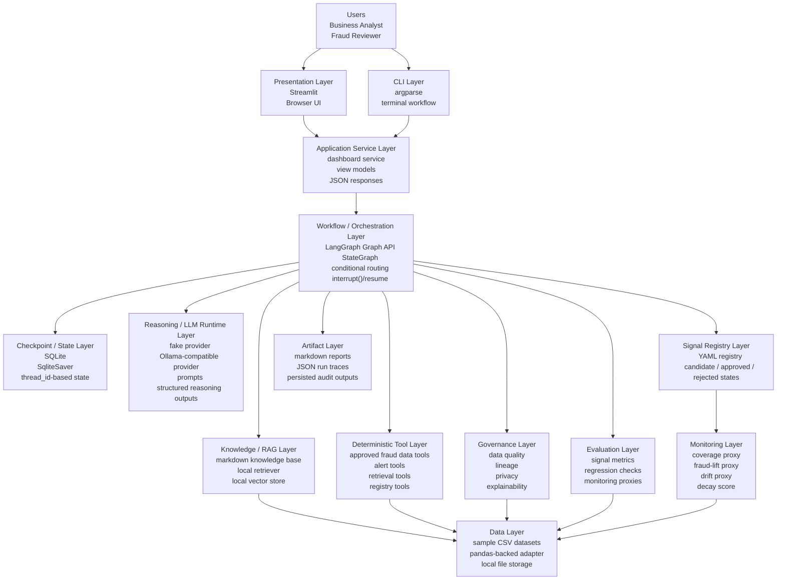
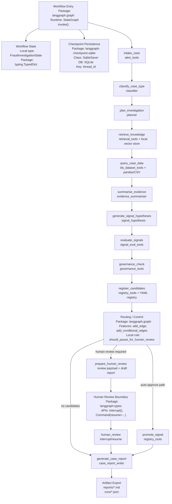

# Architecture Overview

Air-lab Fraud Agentic AI is designed as an enterprise-style analyst-assist system, not
as a single chatbot. The key architectural rule is strict separation between:

- presentation
- service orchestration
- workflow state/control
- reasoning
- deterministic controls
- governed artifacts

---

## Core Separation

```text
Business Analyst / Reviewer
            |
            v
     Streamlit Dashboard
            |
            v
     dashboard.service
            |
            v
 LangGraph Workflow / StateGraph
            |
            +-- LLM reasoning layer
            +-- RAG / knowledge retrieval
            +-- approved data tools
            +-- governance checks
            +-- signal evaluation
            +-- signal registry
            +-- reports and run traces
```

---

## Full Stack View



---

## Workflow / Orchestration Deep Dive



---

## Why This Structure Matters

- The Streamlit app stays presentation-only.
- The service layer hides workflow complexity from the UI.
- LangGraph owns orchestration, pause/resume, and checkpointed state.
- The LLM runtime is a dependency of reasoning, not the orchestration engine itself.
- Deterministic tools, not the LLM, own governed data access and control actions.
- Reports, traces, and monitoring are explicit artifacts rather than implicit logs.

---

## Enterprise Interpretation

This local implementation stays small, but the boundaries map cleanly to enterprise
architecture:

- `streamlit_app/` -> internal analyst portal
- `dashboard.service` -> application service layer
- `graph/` -> orchestration tier
- `langgraph` + SQLite checkpointer -> stateful workflow runtime
- `tools/` -> governed tool/API layer
- `knowledge/` + `rag/` -> enterprise retrieval layer
- `signal_registry/` -> governed Signal Layer / feature registry
- `reports/` + `runs/` -> audit evidence and observability artifacts
